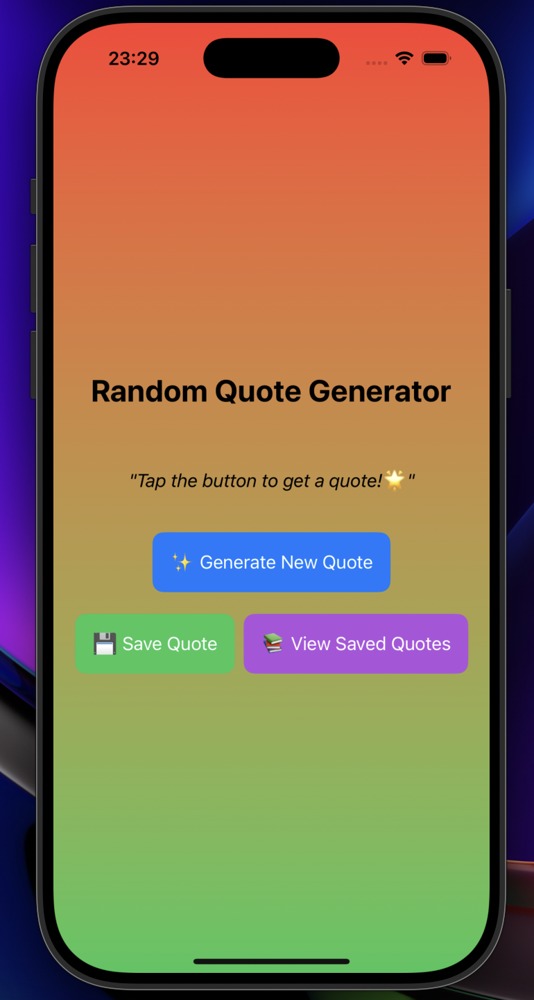

# 🌟 Random Quote Generator 🌟

## ✨ Description
The **Random Quote Generator** is a visually engaging iOS app that fetches and displays random motivational quotes with dynamic styling. Featuring **🌞 light** and **🌙 dark modes**, smooth animations, and a clean UI, the app is perfect for inspiration seekers.

---

## 🌟 Features
1. **📝 Random Quotes**
   - Fetch motivational quotes dynamically from an online API.
2. **🎨 Dynamic Themes**
   - Automatically adapts the UI to light or dark mode.
3. **💾 Save Quotes**
   - Save your favorite quotes for quick access later.
4. **📤 Share Quotes**
   - Share inspiring quotes with friends via social media or messaging apps.
5. **✨ Smooth Animations**
   - Enjoy a polished user experience with fade-in transitions and interactive buttons.

---

## 🛠️ Requirements
- **📱 iOS Version**: 15.0+
- **🖥️ Xcode Version**: 14.0+
- **⚙️ Swift Version**: 5.6

---

## 🚀 Installation
1. Clone the repository:
   ```bash
   git clone https://github.com/your-repo/random-quote-generator.git
   ```
2. Open the project in Xcode:
   ```bash
   cd random-quote-generator
   open RandomQuoteGenerator.xcodeproj
   ```
3. Build and run the project on a simulator or device.

---

## 🎮 How to Use
1. **✨ Generate Quotes**
   - Tap the "Get Quote" button to fetch a new quote.
2. **💾 Save Favorites**
   - Save your favorite quotes with the "Save Quote" button.
3. **📤 Share Inspiration**
   - Use the "Share Quote" button to inspire your friends.

---

## 📸 Screenshots
1. 

---

## 🗂️ Folder Structure
```
RandomQuoteGenerator/
├── 🍎 Assets.xcassets/       # Image and color assets
├── 🖌️ ContentView.swift      # Main UI file
├── 📖 SavedQuotesView.swift   # Saved quotes screen
├── 🌐 QuoteAPI.swift         # Quote fetching logic
├── 📄 README.md              # Documentation
```

---

## 💡 Future Improvements
1. **❤️ Favorites Section**
   - Add a dedicated screen for saved quotes.
2. **📊 Quote Analytics**
   - Track which quotes are saved or shared the most.
3. **🌐 Expanded API Support**
   - Integrate with multiple quote APIs for more variety.

---

## 🤝 Contributing
1. Fork the repository.
2. Create a feature branch:
   ```bash
   git checkout -b feature-name
   ```
3. Commit your changes:
   ```bash
   git commit -m "Add feature description"
   ```
4. Push to the branch:
   ```bash
   git push origin feature-name
   ```
5. Open a Pull Request.

---

## 📜 License
This project is licensed under the MIT License. See the [LICENSE](Apptora) file for details.

---

**👨‍💻 Developed with ❤️ by [Pubudu Dilshan]**
